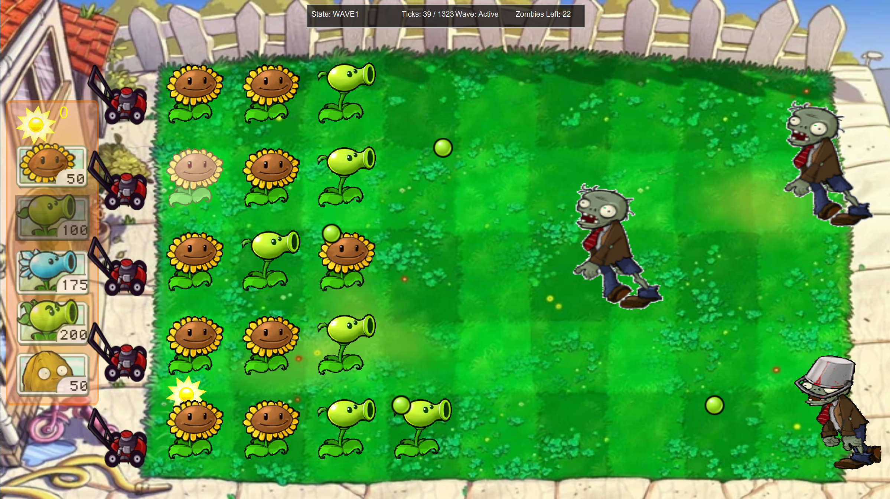

<head>
  
</head>
<body>
  

    <h1>PVZ - Plants vs Zombies en Java</h1>

 <h2>📜 Sommaire</h2>
 <ul class="summary">
   <li><a href="#description">Description</a></li>
   <li><a href="#objectifs-du-projet">Objectifs</a></li>
   <li><a href="#structure-du-projet">Structure</a></li>
   <li><a href="#installation">Installation</a></li>
   <li><a href="#execution">Exécution</a></li>
   <li><a href="#contributions">Contributions</a></li>
   <li><a href="#licence">Licence</a></li>
 </ul>

 

 <h2 id="description">Description</h2>
 
<strong>PVZ</strong> est une réécriture en Java du célèbre jeu <em>Plants vs Zombies</em>, développé à titre éducatif pour approfondir mes connaissances en programmation orientée objet et dans le développement de jeux en Java.

 <ul>
   <li>Une architecture bien structurée basée sur un diagramme de classes.</li>
   <li>L'utilisation d'assets graphiques pour recréer l'expérience visuelle de <em>Plants vs Zombies</em>.</li>
   <li>Un objectif éducatif d'introduire une intelligence artificielle avec des réseaux de neurones pour entraîner le jeu à jouer automatiquement.</li>
 </ul>
 

   ⚠️ <strong>Note importante :</strong> Les assets graphiques utilisés ne sont pas libres de droits et appartiennent à <strong>PopCap Games</strong>.
 

 <table>
   <tr>
     <th>Technologie</th>
     <th>Description</th>
   </tr>
   <tr>
     <td>Java</td>
     <td>Langage principal du projet</td>
   </tr>
   <tr>
     <td>JavaFX</td>
     <td>Pour l'interface graphique</td>
   </tr>
 </table>

 <h2 id="objectifs-du-projet">Objectifs du projet</h2>
 <ol>
   <li><strong>Phase 1 : Développement du jeu</strong>
     <ul>
       <li>Recréer les mécaniques de base de <em>Plants vs Zombies</em>.</li>
       <li>Intégrer des classes pour les plantes, les zombies, et les projectiles.</li>
       <li>Ajouter une interface utilisateur simplifiée.</li>
     </ul>
   </li>
   <li><strong>Phase 2 : Intelligence artificielle</strong>
     <ul>
       <li>Développer un modèle de réseau de neurones en Java (ou en Python).</li>
       <li>Entraîner l'IA pour qu'elle puisse jouer au jeu automatiquement.</li>
     </ul>
   </li>
 </ol>

 <h2 id="structure-du-projet">Structure du projet</h2>
 <pre><code>// Le contenu de la structure de dossier est inchangé car il est trop long pour ce format.
 </code></pre>

 <h2 id="installation">Installation</h2>
 <ol>
   <li><strong>Pré-requis :</strong>
     <ul>
       <li>Java 23 ou une version supérieure.</li>
     </ul>
   </li>
   <li><strong>Étapes :</strong>
     <ul>
       <li>Clonez le repository : <code>git clone https://github.com/&lt;ton-nom-d-utilisateur&gt;/pvz-java.git</code></li>
       <li>Ou téléchargez le JAR exécutable directement.</li>
     </ul>
   </li>
 </ol>

 <h2 id="execution">Exécution</h2>
 
<strong>Avec interface graphique :</strong>

 <pre><code>java -jar pvz.jar gui</code></pre>

 
<strong>Sans interface graphique :</strong>

 <pre><code>java -jar pvz.jar</code></pre>

 <h2 id="contributions">Contributions</h2>
 
Ce projet est avant tout un exercice personnel, mais si vous souhaitez contribuer :

 <ol>
   <li>Forkez ce dépôt.</li>
   <li>Travaillez sur votre propre branche.</li>
   <li>Soumettez une <strong>pull request</strong>.</li>
 </ol>

 <h2 id="licence">Licence</h2>
 
Ce projet est publié sous la licence <strong>MIT</strong>, mais les assets graphiques utilisés sont soumis aux droits d'auteur de <strong>PopCap Games</strong> et ne peuvent pas être utilisés en dehors de ce projet éducatif.

  

</body>